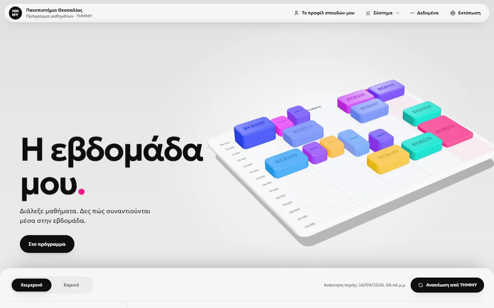
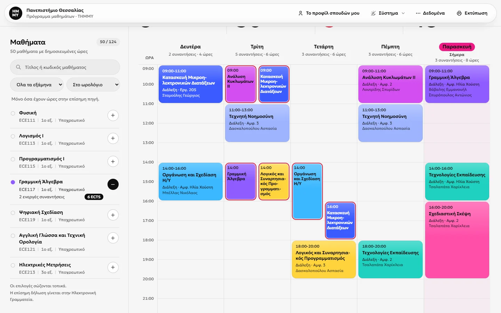
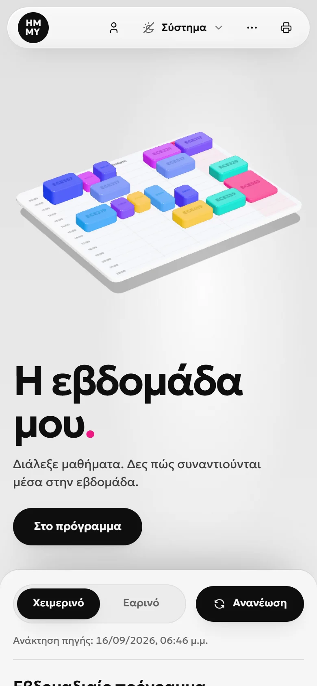
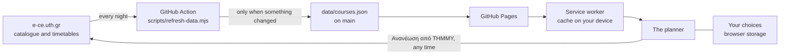

<div align="center">


# Η εβδομάδα μου · ΤΗΜΜΥ

**A week planner for the Electrical and Computer Engineering department of the University of Thessaly.**<br>
Pick your courses, see how they meet across the week, and check them against the study guide's rules.

**[Open the planner](https://fueledbyredbull.github.io/thmmy-planner/)**

[](https://github.com/FueledByRedBull/thmmy-planner/actions/workflows/pages/pages-build-deployment)
[](https://github.com/FueledByRedBull/thmmy-planner/actions/workflows/refresh-data.yml)

</div>

<picture>
  <source media="(prefers-color-scheme: dark)" srcset="docs/screenshots/hero-dark.webp">
  
</picture>

## What it does

- **Builds your week from the official timetable.** Search the catalogue by title or code, filter by semester, and add courses. Their meetings land on a five-day grid for the fall (Χειμερινό) or spring (Εαρινό) semester, and you choose which lab or tutorial sessions you take.
- **Shows clashes at a glance.** Parallel lessons share a day in lanes, overlaps get a red outline, and courses you are unsure about get a dashed review mark. Colours go by course or by semester.
- **Checks your plan.** Set your entry year, current semester and passed courses in *Το προφίλ σπουδών μου*. *Έλεγχος προγράμματος & δήλωσης* then checks the plan against the 2024-25 study guide's rules, and every check explains itself.
- **Stays current.** The timetable is refreshed from the department's site every night. *Ανανέωση από ΤΗΜΜΥ* fetches it on demand, and *Τι άλλαξε* lists exactly what moved, appeared or disappeared since your last data.
- **Moves with you.** Short `THMMY2:` transfer codes carry your choices to another browser (older `THMMY1.` codes still import). A standalone HTML copy works fully offline. The week prints on one A4 page in your theme.
- **Feels like an app.** It opens instantly after the first visit, works offline, can be installed to your home screen or desktop, and tells you when a new version is out. Light, dark or system theme.

<table>
  <tr>
    <td width="72%">
      <picture>
        <source media="(prefers-color-scheme: dark)" srcset="docs/screenshots/planner-dark.webp">
        
      </picture>
    </td>
    <td width="28%">
      <picture>
        <source media="(prefers-color-scheme: dark)" srcset="docs/screenshots/phone-dark.webp">
        
      </picture>
    </td>
  </tr>
</table>

## How it stays current



- **Nightly.** At 02:17 UTC, [`refresh-data.yml`](.github/workflows/refresh-data.yml) downloads the catalogue and both timetables. It parses them with the app's own [`source-parser.js`](assets/source-parser.js) in headless Chrome, so the result is exactly what the app would produce. It commits only when something changed, and refuses results that look broken (a shrunken catalogue, or a published timetable that came back empty).
- **On your next visit,** the planner takes the new snapshot in the way a manual refresh does: your meeting choices are remapped, selected courses that left the catalogue are kept, and *Τι άλλαξε* shows the differences.
- **On demand,** *Ανανέωση από ΤΗΜΜΥ* fetches the same pages from the browser through a public CORS proxy (r.jina.ai or allorigins, chosen in *Πηγές & ενημέρωση*). You can also import an official page you saved yourself.

## Privacy

Your selections, passed courses, review marks and preferences stay in your browser; there are no accounts, analytics or cookies. Transfer codes hold only your choices, never personal data. The only requests that leave the site are for the official pages, and only when you press *Ανανέωση από ΤΗΜΜΥ*.

## Performance

Measured in headless Chrome with the CPU slowed 4× and a fast-4G connection:

| | First visit | Repeat visit (service worker) |
|---|---|---|
| First paint | ~220 ms | ~80 ms |
| Planner ready | ~440 ms | ~280 ms |
| 3D week ready | ~0.9 s | ~0.6 s |
| Transferred | ~272 KB (157 KB of it the 3D week) | 0 KB |

The 3D week loads after the page is ready and compiles its shaders, the studio reflection's included, in parallel off the main thread. It draws at 30 fps and sleeps between frames when only its slow drift moves, smooth scrolling runs only while a scroll is easing, and nothing runs at all once you scroll to the planner.

## Project structure

```text
index.html                the page: app shell, preloads, content security policy
sw.js                     service worker: instant repeat visits, offline use, update prompt
manifest.webmanifest      install metadata
assets/
  app.js                  the planner: catalogue, week, checks, storage, print, backup
  source-parser.js        reads the official pages (shared with the nightly refresh)
  styles.css              design tokens, layout, print
  motion.js               smooth scrolling (Lenis) and loading the 3D week
  week3d.js               the 3D week, bundled from src/week3d.js
  vendor/lenis.min.js
  fonts/                  Geologica and Noto Sans subsets, with OFL.txt
  icons/                  app icons
data/
  courses.json            catalogue and timetables, refreshed nightly
  guide.json              study-guide rules behind the checks
src/week3d.js             source of the 3D week (Three.js)
scripts/refresh-data.mjs  the nightly data refresh
.github/workflows/        refresh-data.yml
docs/screenshots/         images for this README
DESIGN.md, PRODUCT.md     design system and product notes (.impeccable/ holds their machine-readable form)
```

## Development

There is no build step for the app: edit `index.html`, `assets/` and `data/` directly, and GitHub Pages serves the root of `main`. To run it locally, serve the folder over HTTP (the service worker works on `localhost`; opening `index.html` as a file does not):

```sh
python -m http.server 8000
```

**Versions and caching.** When an asset changes, bump its `?v=` query in `index.html` (or in `assets/motion.js` for `week3d.js`). The data files and `app.js` are also preloaded in the `<head>`: keep those URLs identical to the ones the loader uses, or the preload is wasted. The nightly refresh updates `courses.json?v=` itself (its version is the first 12 hex digits of the file's SHA-256).

**The 3D week** is the one bundled file. After editing `src/week3d.js`, rebuild it with esbuild 0.28 and three 0.186.1:

```sh
npm install --no-save esbuild@0.28.2 three@0.186.1
npx esbuild src/week3d.js --bundle --minify --format=esm --legal-comments=eof --outfile=assets/week3d.js
```

**The data refresh** runs locally too (Node 22 or newer and Chrome; set `CHROME_PATH` if Chrome is not in its usual place):

```sh
node scripts/refresh-data.mjs --dry-run   # report what changed, write nothing
node scripts/refresh-data.mjs             # update data/courses.json and its version in index.html
```

To run the nightly job right away, use *Run workflow* on the [workflow's page](https://github.com/FueledByRedBull/thmmy-planner/actions/workflows/refresh-data.yml), or `gh workflow run refresh-data.yml`. Commits made with the workflow's token do not start a Pages build on their own, so the job requests one.

**Updates and the service worker.** Updates need no extra step. The page asks `sw.js` to check for a new `index.html` when it loads, when it comes back into view and every half hour. A changed page has its files (read from `index.html`, `assets/motion.js` and `assets/styles.css`) cached first; the page then shows a "new version" prompt whose reload is instant. Change `CACHE` in `sw.js` only when its own caching changes; the new worker then waits behind the same prompt. If a published `sw.js` ever misbehaves, replace it with one whose `install` and `activate` handlers call `self.registration.unregister()`.

Design decisions live in [`DESIGN.md`](DESIGN.md) and [`PRODUCT.md`](PRODUCT.md).

## Credits

- Timetables and catalogue: the public pages of the department at [e-ce.uth.gr](https://www.e-ce.uth.gr/).
- [Geologica](https://github.com/googlefonts/geologica) and [Noto Sans](https://github.com/notofonts/latin-greek-cyrillic), SIL Open Font License 1.1 ([`assets/fonts/OFL.txt`](assets/fonts/OFL.txt)).
- [Three.js](https://threejs.org/) (MIT, notice at the end of `assets/week3d.js`), [Lenis](https://github.com/darkroomengineering/lenis) (MIT) and [Tabler Icons](https://tabler.io/icons) (MIT).

This is an unofficial tool. The official course declaration is made in the university's Electronic Secretariat (Ηλεκτρονική Γραμματεία).

## License

The planner's own code is released under the [MIT License](LICENSE). The timetable and catalogue data belong to the department, and the fonts and libraries above keep their own licenses.
